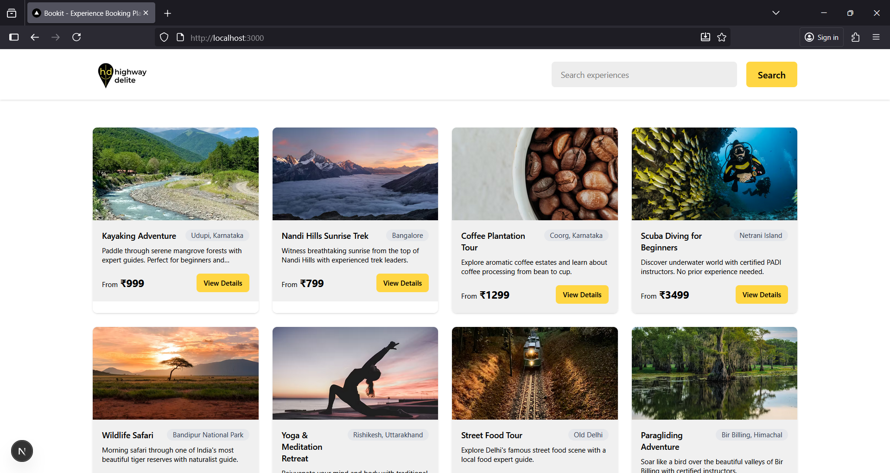

# BookIt - Experiences & Slots Booking Platform

A full-stack web application for booking travel experiences and activities. Built with Next.js, TypeScript, Tailwind CSS, and MongoDB.

## 🚀 Live Demo

- **Frontend**: [Live URL] (Add your deployment URL here)
- **Backend API**: [API URL] (Add your backend deployment URL here)

## 📋 Project Overview

BookIt is a complete booking platform that allows users to:
- Browse available travel experiences
- View detailed information and available time slots
- Book experiences with user information and promo codes
- Receive booking confirmations

## 🛠️ Tech Stack

### Frontend
- **Framework**: Next.js 14 with App Router
- **Language**: TypeScript
- **Styling**: Tailwind CSS
- **State Management**: React Hooks
- **Icons**: Lucide React

### Backend
- **Runtime**: Node.js
- **Framework**: Next.js API Routes
- **Database**: MongoDB with Mongoose ODM
- **Validation**: Mongoose schema validation

## 📁 Project Structure

```
bookit/
├── src/
│   ├── app/                    # Next.js App Router
│   │   ├── api/               # Backend API Routes
│   │   │   ├── experiences/
│   │   │   ├── bookings/
│   │   │   └── promo/
│   │   ├── details/[id]/      # Experience details page
│   │   ├── checkout/          # Checkout page
│   │   ├── result/            # Booking result page
│   │   └── page.tsx           # Home page
│   ├── components/            # React components
│   │   ├── ui/
│   │   ├── cards/
│   │   └── forms/
│   ├── lib/                   # Utilities and configurations
│   ├── models/                # MongoDB models
│   ├── services/              # API service functions
│   └── types/                 # TypeScript type definitions
├── public/                    # Static assets
└── package.json
```

## 🚀 Getting Started

### Prerequisites

- Node.js 18.17 or later
- MongoDB database (local or MongoDB Atlas)
- npm or yarn

### Installation

1. **Clone the repository**
   ```bash
   git clone https://github.com/Shubham0202/highway-delite-assigment
   cd bookit
   ```

2. **Install dependencies**
   ```bash
   npm install
   ```

3. **Environment Setup**
   Create a `.env.local` file in the root directory:
   ```env
   MONGODB_URI=your_mongodb_connection_string
   NODE_ENV=development
   ```

4. **Seed the Database** (Optional)
   Visit `/api/seed` to populate the database with sample data:
   steps 1) open your browser (this steps are after starting next server)
         2) go to `http://localhost:3000/api/seed`
         3) see you home page
   ```bash
   # Or run the seed script directly
   npm run seed
   ```

6. **Run the development server**
   ```bash
   npm run dev
   ```

7. **Open your browser**
   Navigate to [http://localhost:3000](http://localhost:3000)

## 🎯 Features

### Frontend Features
- ✅ Responsive design matching Figma specifications
- ✅ Experience browsing with search functionality
- ✅ Detailed experience pages with slot selection
- ✅ Booking form with validation
- ✅ Promo code validation
- ✅ Booking confirmation flow
- ✅ Loading states and error handling

### Backend Features
- ✅ RESTful API endpoints
- ✅ MongoDB database integration
- ✅ Experience and slot management
- ✅ Booking system with validation
- ✅ Promo code validation system
- ✅ CORS enabled for frontend communication

## 📡 API Endpoints

### Experiences
- `GET /api/experiences` - Get all experiences
- `GET /api/experiences/[id]` - Get specific experience details

### Bookings
- `POST /api/bookings` - Create a new booking

### Promo Codes
- `POST /api/promo/validate` - Validate promo codes

## 🗃️ Database Models

### Experience
- Title, description, location, price
- Images, duration, category
- Available slots with dates and times
- Rating and review information

### Booking
- User information (name, email, phone)
- Experience and slot references
- Pricing and discount information
- Booking status and reference ID

### PromoCode
- Code, discount type and value
- Validity periods and minimum amounts
- Usage tracking

## 🎨 Design Implementation

The application strictly follows the provided Figma design:
- **Colors**: Primary yellow, grayscale palette
- **Typography**: Consistent font scales and weights
- **Spacing**: 8px grid system
- **Components**: Reusable UI components matching design specs
- **Responsive**: Mobile-first approach with desktop optimizations

## 📱 Pages & Flow

1. **Home Page** (`/`)
   - Experience grid with search
   - Filtering and sorting capabilities
   - Responsive card layout

2. **Details Page** (`/details/[id]`)
   - Experience information and gallery
   - Available dates and time slots
   - Booking sidebar with pricing

3. **Checkout Page** (`/checkout`)
   - User information form
   - Promo code application
   - Order summary and payment

4. **Result Page** (`/result`)
   - Booking confirmation
   - Reference number display
   - Success/failure states

## 🔧 Development Scripts

```bash
npm run dev          # Start development server
npm run build        # Build for production
npm run start        # Start production server
npm run lint         # Run ESLint
npm run type-check   # Run TypeScript compiler
```

## 🚀 Deployment

### Frontend Deployment (Vercel)
1. Connect your GitHub repository to Vercel
2. Add environment variables in Vercel dashboard
3. Deploy automatically on git push

### Backend Deployment
The backend is integrated with the frontend using Next.js API routes, so it deploys together with the frontend.

### Database (MongoDB Atlas)
1. Create a MongoDB Atlas cluster
2. Get connection string
3. Add to environment variables

## 🧪 Testing

### Manual Testing Checklist
- [ ] Experience listing loads correctly
- [ ] Search functionality works
- [ ] Experience details page displays information
- [ ] Slot selection and booking flow works
- [ ] Form validation functions properly
- [ ] Promo code validation works
- [ ] Booking confirmation displays correctly
- [ ] Responsive design on mobile/tablet/desktop

## 📄 Environment Variables

| Variable | Description | Example |
|----------|-------------|---------|
| `MONGODB_URI` | MongoDB connection string | `mongodb+srv://...` |
| `NODE_ENV` | Environment mode | `development` or `production` |

## Screenshots



## 📞 Support

For support or questions:
- Create an issue in the GitHub repository
- Contact the development team

## 📝 License

This project is licensed under the MIT License - see the [LICENSE](LICENSE) file for details.

## 🙏 Acknowledgments

- Design provided via Figma
- Images from Unsplash
- Icons from Lucide React
- Built with Next.js and Tailwind CSS

---
